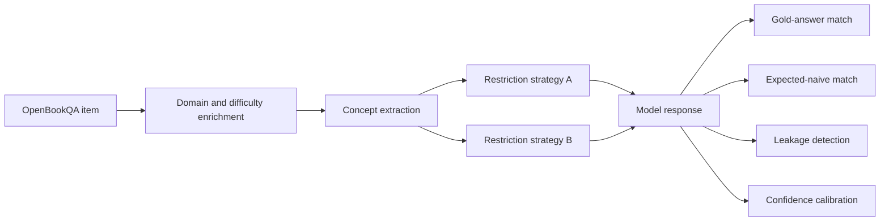

<div align="center">

# Simulating Human Knowledge Gaps in LLMs

**A theory-of-mind evaluation framework for knowledge-restricted perspective taking**

[](https://github.com/Mahdi-Jadidi/llm-knowledge-gap-simulation/actions/workflows/ci.yml)


</div>

## Research question

Can a language model answer from the perspective of a person who has never learned a specific concept, or does it continue to use that concept while merely claiming ignorance?

This repository turns that question into a reproducible OpenBookQA-based experiment. It evaluates correctness, expected naive behavior, knowledge leakage, failure mode, and confidence as separate outcomes.

## Pilot finding

| Measure | Best pilot result |
|---|---:|
| Match to expected knowledge-restricted answer | **62.5%** |

The pilot shows that explicit perspective instructions do not guarantee faithful knowledge restriction. Models can produce fluent, confident explanations that still rely on withheld concepts; this is why leakage analysis is a first-class metric rather than an anecdotal observation.

## Evaluation design



## What is measured

| Dimension | Question answered |
|---|---|
| Gold correctness | Did the model solve the original science question? |
| Perspective fidelity | Did it behave like the restricted agent? |
| Concept leakage | Did the reasoning use knowledge that should be unavailable? |
| Failure mode | Was the failure due to leakage, over-refusal, guessing, or inconsistency? |
| Calibration | Does confidence track behavioral success? |

## Architecture

`provider.py` isolates model APIs, `schemas.py` defines structured outputs, `prompts.py` versions experimental conditions, and the enrichment, concept, simulation, and evaluation modules own distinct stages of the study.

## Quick start

```bash
git clone https://github.com/Mahdi-Jadidi/llm-knowledge-gap-simulation.git
cd llm-knowledge-gap-simulation
pip install -e .
export GOOGLE_API_KEY=...
knowledge-gap-sim generate --data-dir data --output-dir outputs
knowledge-gap-sim analyze --data-dir . --output-dir outputs/analysis
```

The analysis command is fully offline and can reproduce tables from cached CSV artifacts without calling a model API.

## Reproducibility and safety

Prompts and structured schemas are versioned in code. Provider failures are kept separate from behavioral failures, and no API keys are stored in the repository.

## Limitations

The pilot is small and model-dependent. Automatic leakage rules can miss implicit concept use, while expected naive answers may admit more than one plausible response. Larger human-annotated studies are needed before making general claims about model theory of mind.
